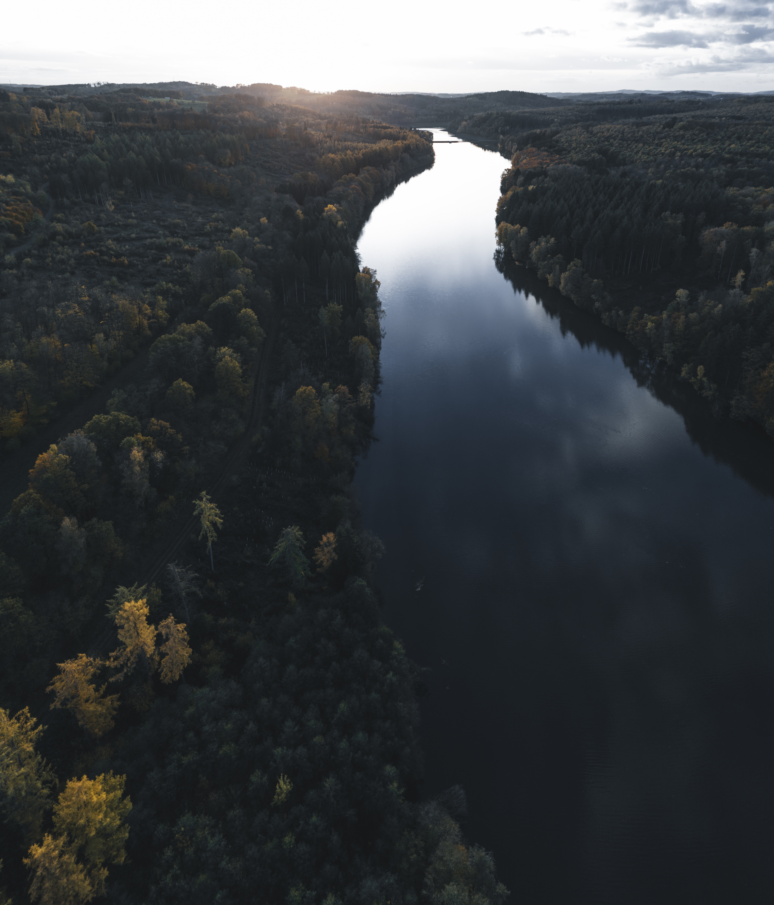
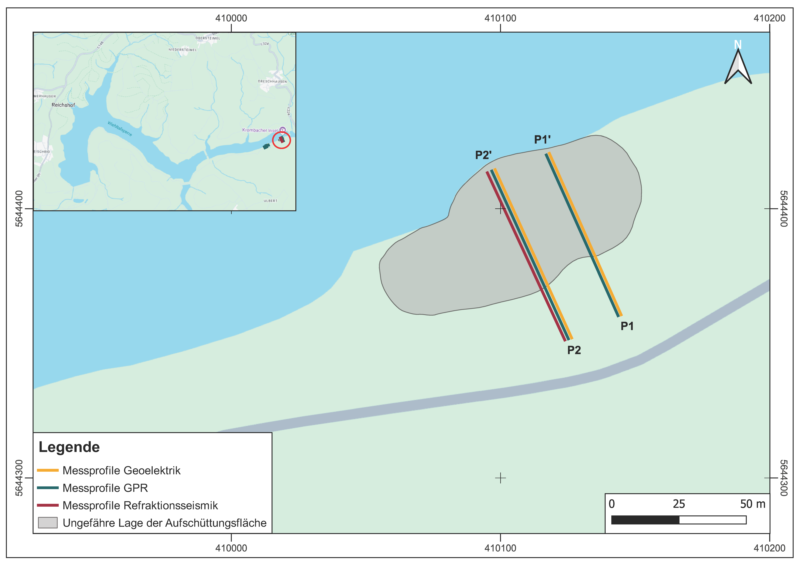

## The field site - Wiehltalsperre
:::: {.columns}
::: {.column width="50%"}

-   Drinking water reservoir near Cologne, Germany

-   Severe **drought and beetle infestation**  lead to massive **forest diebacks** close to reservoir

-   Geophysical surveys should help to answer questions regarding **hydrological settings in near-surface areas** at potential reforesting sites

-   Can we use geophysics in combination with other soil parameter measurements to **make suggestions regarding the reforestation** of certain areas?

:::
::: {.column width="50%"}

:::
::::

## Quantitative imaging and monitoring is challenging
{fig-align="center"}
