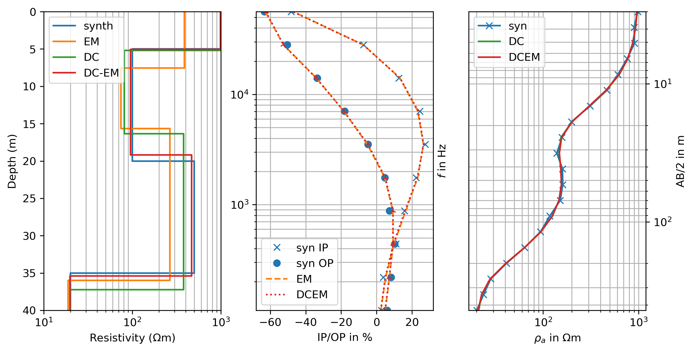
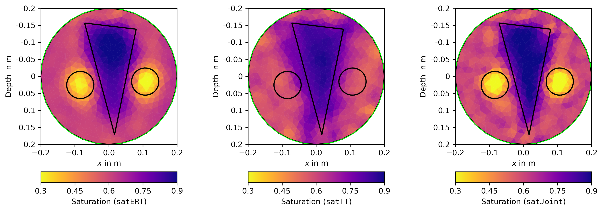
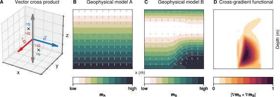
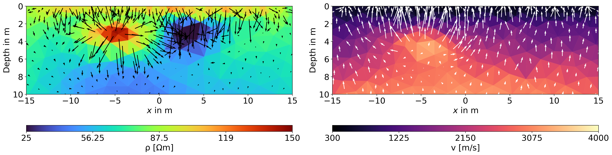

##  Goals of this part of the workshop 

::: {.incremental}
-   Learn the necessary steps to successfully perform a joint inversion.

-   Apply the cross-gradient algorithm to jointly invert SRT and ERT using actual field data.

-   Evaluate and compare the joint inversion results to individually inverted data sets.

-   **Optional:** Apply the algorithm to your own data sets!
:::

## Joint inversion of methods working in same parameter space

:::: {.incremental}
- If two methods are sensitive to the same physical property (e.g. electrical resistivity $\rho$ by using ERT and a electromagnetic method) we can use the same model parameter space for both methods and perform a classical **joint inversion**.
- In the following example we will use vertical electrical sounding (VES) and EM data to jointly invert for the electrical resistivity distribution of the subsurface in a 1D model.

:::

::: {layout-align="center"}
::: {.fragment}
{fig-align="center" width="700"}
:::
::::

## Joint inversion of methods working in different parameter spaces
### Petrophysically coupled joint inversion

::: {.incremental}
-   If two methods are sensitive to different physical properties (e.g. electrical resistivity $\rho$ by using ERT and acoustic velocity $v$ by using SRT) we can use different types of joint inversion algorithms to link the two model parameter spaces.

- One possible approach is to couple both methods by using a petrophysical relationship between the two physical properties. This is called **petrophysically coupled joint inversion**. For example the water saturation can be used to link the electrical resistivity and acoustic velocity of the subsurface.
:::
## Joint inversion of methods working in different parameter spaces

- Finally, we invert again in the same parameter space.

 

{fig-align="center"}

## Joint inversion of methods working in different parameter spaces
### Structurally coupled joint inversion

:::: {.incremental}
- If a petrophysical relationship is not known or cannot be applied, we can use a **structurally coupled joint inversion**. In this case, we assume that the two physical properties are structurally related, i.e. they have similar spatial distributions. This can be achieved by using a **cross-gradient constraint** in the inversion.

- For this purpose, we define the cross-gradient function $\Phi_{cg}$ as the integral of the squared magnitude of the cross product of the gradients of the two physical properties:

::: {.fragment}
$$\Phi_{cg} = \int \left| \nabla \mathbf{\rho}(i) \times \nabla \mathbf{v}(i) \right|^{2}$$
:::
::::

## The idea of cross-gradients

 

## Joint inversion of methods working in different parameter spaces
### Structurally coupled joint inversion

- The gradients of two models in different parameter spaces are parallel if the cross-gradient function $\Phi_{cg}$ is zero. In this case, the two models are structurally quite similar.

  

{fig-align="center"}

##  Takeaway messages:
:::{.incremental}
- which type of joint inversion to use depends on the physical properties of the methods used.

- If the methods are sensitive to the same physical property, a classical joint inversion can be used.

- If the methods are sensitive to different physical properties, a petrophysically coupled or structurally coupled joint inversion can be used.

- A petrophysically coupled joint inversion requires a known petrophysical relationship between the two physical properties.

- Often, a structurally coupled joint inversion is used, which requires no petrophysical relationship between the two physical properties.
::: 