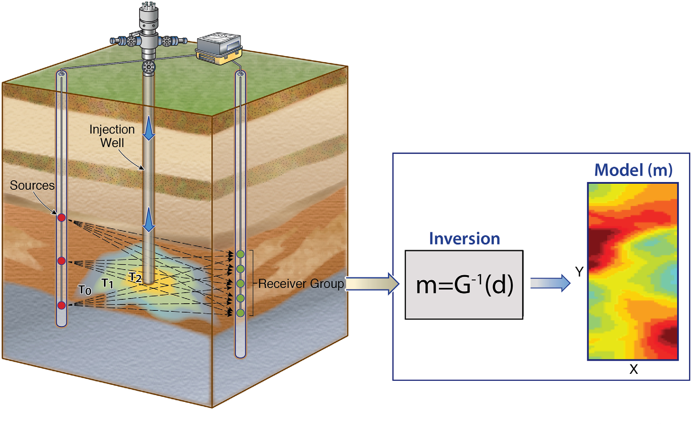
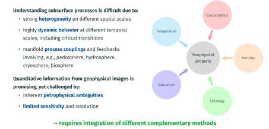
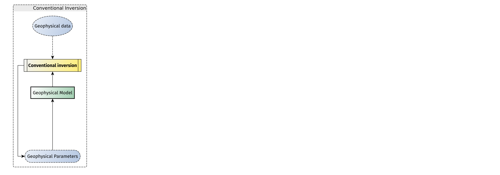
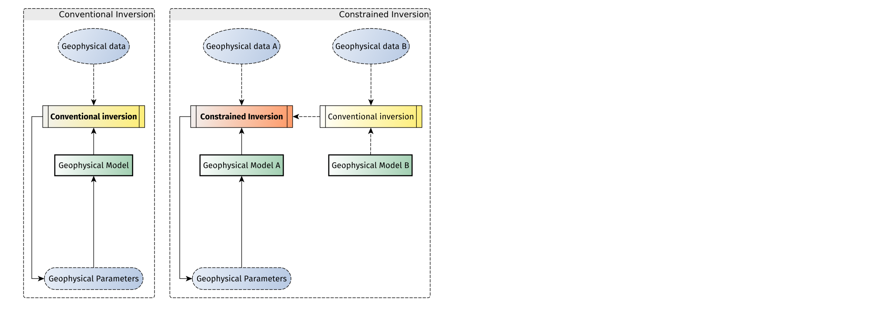
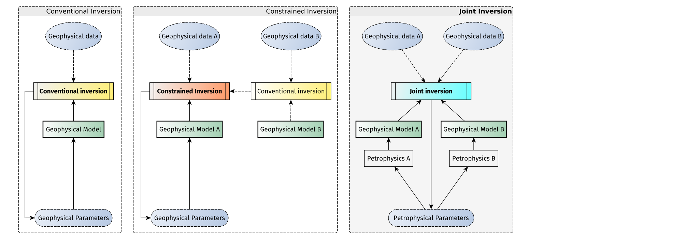
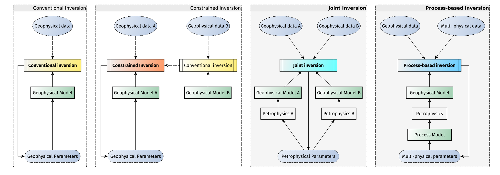

## Geophysical monitoring of subsurface processes

## Quantitative imaging and monitoring is challenging

## The evolution of geophysical imaging for subsurface characterization

{.absolute top=180 left=0 width=1200}
{.fragment .fade-in-then-out .absolute top=180 left=0 width=1200}
{.fragment .fade-in-then-out .absolute top=180 left=0 width=1200}
{.fragment .fade-in .absolute top=180 left=0 width=1200}

[[@Wagner2021]]{.muted .absolute bottom=40 right=20 style="font-size: 0.6em;"}

[--> model coupling is challenging and requires versatile open-source software]{.fragment .absolute bottom=80 left=20}
