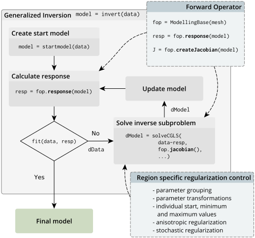
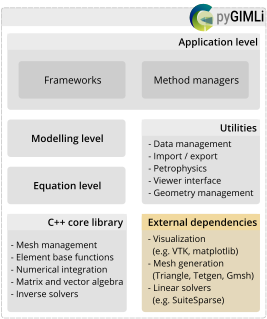

##  py**GIMLi** is a versatile open-source toolbox with:
::: {.columns}
::: {.column width="65%" .incremental}
- management tools for **structured and unstructured meshes** in 2D & 3D
- computationally efficient **finite-element and finite-volume solvers**
- **various geophysical forward operators**: ERT/IP, Traveltime, Gravimetry, Magnetics, SP, EM
- frameworks for **constrained, joint and
process-based inversions** with **region-specific regularization**
- **open-source, platform compatible**, documented & tested code
- suitability for **teaching & reproducible research**
- v1.0 published in *Computers and Geosciences* [@Ruecker2017] [(among *Most Downloaded* papers, > 430 citations, > 120 uses in peer-reviewed papers)]{.muted}
:::
::: {.column width="30%"}
::: {.r-stack}


:::
:::
:::

## Basic inversion framework {.smaller}
:::: {.columns}
::: {.column}

The default inversion framework is based on the generalized Gauss-Newton method and is compatible with any given forward operator and thus applicable to various physical problems.

$$ \| \mathbf{W}_\text{d} (\mathbf{F}(\mathbf{m})-\mathbf{d}) \|^2_2 + \lambda \| \mathbf{W}_\text{m} (\mathbf{m}-\mathbf{m_0}) \|^2_2 \rightarrow\min $$

::: {.callout-note}
The inversion is physics-independent and very flexible in terms of adding prior information, regularization and integrating different geophysical methods.
:::

Website and documentation: <https://pygimli.org>
:::

::: {.column}

:::

::::

## Software design {.smaller}
:::: {.columns}
::: {.column width="60%"}

pyGIMLi is organized in three different abstraction levels:

::: {.panel-tabset}
## Application level

In the application level, ready-to-use method managers and frameworks are provided. Method managers (`pygimli.manager`) hold all relevant functionality related to a geophysical method. A method manager can be initialized with a data set and used to analyze and visualize this data set, create a corresponding mesh, and carry out an inversion. Various method managers are available in `pygimli.physics`. Frameworks (`pygimli.frameworks`) are generalized abstractions of standard and advanced inversions tasks such as time-lapse or joint inversion for example. Since frameworks communicate through a unified interface, they are method independent.

## Modelling level

In the modelling level, users can set up customized forward operators that map discretized parameter distributions to a data vector. Once defined, it is straightforward to set up a corresponding inversion workflow or combine the forward operator with existing ones.

## Equation level

The underlying equation level allows to directly access the finite element (`pygimli.solver.solveFiniteElements()`) and finite volume (`pygimli.solver.solveFiniteVolume()`) solvers to solve various partial differential equations on unstructured meshes, i.e. to approach various physical problems with possibly complex 2D and 3D geometries.

:::

:::

::: {.column width="40%"}

:::

::::

##  Existing tutorials

::: {.columns}
::: {.column .incremental width="55%"}
- [Transform 2021](http://transform21.pygimli.org): creating **geometries & meshes**, **modeling** PDEs, **synthetic data**, **inversion** (also with **external forward operator**).
- [Transform 2022](http://transform22.pygimli.org):  fundamental `pyGIMLi` objects (`Mesh`, `DataContainer`, matrix types, etc.), **geostatistical** vs. smoothness regularization, treatment of subsurface **regions**, adding **prior data**.
- [SEG webinar 2024](http://seg24.pygimli.org): invert **real-life 3D data** [@Huebner2017] to tweak your **inversion beyond the standard** practice. 
- Today we **practise** & focus on **combining near-surface geophysical data** for joint interpretation and inversion.
:::
::: {.column width="45%"}
{width=90%}
:::
:::

##  What is new since?

::: {.noincremental}
- work-in-progress [**user guide**](https://www.pygimli.org/user-guide/) 
- **Improved 3D visualization** powered by [pyvista](https://pyvista.org) (filters, slices, interactivity)
- **3D gravity and (full-tensor) magnetics** operators and managers
- **New matrices and matrix generators**, e.g. non-explicit (PDE-based) Jacobian matrix
- `LSQRinversion` framework to include parameter relations [from @Wagner2019]
- added **Structurally coupled cooperative inversion** (SCCI) as separate inversion class
- `MultiFrameModelling` framework for temporally/spectrally/spatially constraints
- `TimelapseERT` class with different strategies, e.g. **4D inversion**
- **New examples** on ERT (2D/3D crosshole, 3D surface, timelapse), IP, 3D magnetics
- Many more **convenience functions** to simplify the code
- Many **new papers using pyGIMLi** (<https://pygimli.org/publist.html>)
:::

##  New since v1.5.0 (SEG webinar)

https://github.com/gimli-org/gimli/releases

- enabled `pip install pygimli` for easier installation (e.g. on Google Colab)
- new **examples** (e.g. reciprocals) and improved old ones
- better access to **Jacobian, resolution matrices** etc.
- **syntactic sugar** (`data.show('i')`, `mesh.show('res')`, `data.estimateError()`)
- new **mesh functions**:<br> e.g., `submesh()`, `extract2dUpperSurfaceMesh()`, `extract2dSlice()` 
- new **matrix types**, e.g. for BFGS-based inversion
- different **inversion frameworks** (SD, NLCG, GN, L_BFGS, BFGS)
- fully **complex-valued** (FD) ERT-IP inversion (also for TD)
- improvements in **gravity, magnetics and TDEM**
- a lot of of bug fixes and improved docstrings

##  Join the pyGIMLi user community!

::: {.columns}
::: {.column width="50%"}


> "In open source, we feel strongly that to really **do something well**, you have to get a lot of people involved."
>
> *– Linus Torvalds*
:::

::: {.column width="40%" .noincremental}
1. **Join the `#pyGIMLi` chat** on [Mattermost](https://softwareunderground.org/mattermost)!
2. **Open a discussion** or **raise an issue** [on  GitHub](https://github.com/gimli-org/gimli).
3. **Contribute to the website** via the "Improve this page" button in the right sidebar.
4. **Add your** pyGIMLi-powered **publication** to [this database](https://github.com/gimli-org/gimli/blob/dev/doc/gimliuses.bib).
5. **Send your example** to [mail@pygimli.org](mailto:mail@pygimli.org).
6. **Contribute to the code** as described in [our contribution guidelines.](https://pygimli.org/contrib.html)
:::
:::

## The code base -- `ERT` module

:::: {.columns}
::: {.column width="70%"}
- import and export of various formats
- utility functions and data visualization
- array generation and synthetic model simulation
- `ERTManager` for data inversion and model output
- `ERTIPManager` for FD or TD Induced Polarization (IP)
- `TimelapseERT` (and `CrossholeERT`) class for timelapse ERT
- spectral IP analysis in `pyBERT` module (`FDIP` and `TDIP`)
:::
::: {.column width="30%"}

:::
::::


##  The `TimelapseERT` class

- designed for surface ERT data (crosshole: `CrossholeERT`)
- different import formats and export of filtered data
- extract data time series with `.showTimeline()`
- extensive filter function (`t`, `tmin`, `tmax`, `kmax`)
- masking of data with app. resistivity & error bounds (`.mask()`)
- automatic masking based on harmonic filtering
- different types of data visualization and PDF generation
- temporal fitting of reciprocal error models
- invert single timesteps, sequentially or full ("4D" inversion)

##  The `CrossholeERT` class

- based on `TimelapseERT` with some extra functions
- different visualization methods
- adapted mesh generation 
- attributes electrodes to boreholes
- `extractSubset` to retrieve (3D) parts or (2D) planes

 Make whole processing chain transparent and reproducible


## The code base -- `traveltime` module

:::: {.columns}
::: {.column width="50%"}
- import and export of various formats
- utility functions and data visualization
- array generation and synthetic model simulation
- `TravelTimeManager` for data inversion and model output
- several convenience functions to evaluate and visualize results
:::
::: {.column width="50%"}

:::
::::

##  Crosshole traveltime tomography

:::: {.columns}
::: {.column width="50%"}
- based on functions implemented in `traveltime` manager
- `createCrossholeData()` allows to generate synthetic crosshole data
- inversion and evaluation based on functions given in 'traveltime' manager
:::
::: {.column width="50%"}

:::
::::


## The code base -- joint inversion frameworks

:::: {.columns}
::: {.column width="50%"}
- import and export of various formats
- utility functions and data visualization
- array generation and synthetic model simulation
- `TravelTimeManager` for data inversion and model output
- several convenience functions to evaluate and visualize results
:::
::: {.column width="50%"}

:::
::::

##  Cross gradient joint inversion
:::: {.columns}
::: {.column width="50%"}
- please add some important aspects on cross-gradient JI
- and maybe also a nice picture showing the effects comapred to individual inversions 
:::
::: {.column width="50%"}

:::
::::

##  Structurally coupled cooperative inversion (SCCI)
:::: {.columns}
::: {.column width="50%"}
- own class in `pygimli.frameworks`
- allows structurally coupled multi-method inversions 
- coupling strengths adjusted by `scci.a`, `scci.b`, `scci.c`
- visualization of coupling strength per boundary via `drawCWeight`
:::
::: {.column width="50%"}

:::
::::

##  How to get started

1. Open [Miniforge Prompt](https://docs.anaconda.com/free/anaconda/install/) () or a Terminal (/).
2. Follow the [installation guideline](https://www.pygimli.org/user-guide/getting-started/installation/#installation) on the pyGIMLi website.

```bash
conda create -n pg
conda activate pg

conda install -c gimli pygimli
```

::: {.callout-tip}
## Follow without a local installation
You can also visit <https://colab.research.google.com>, open an empty notebook and type `!pip install pygimli tetgen`.
:::