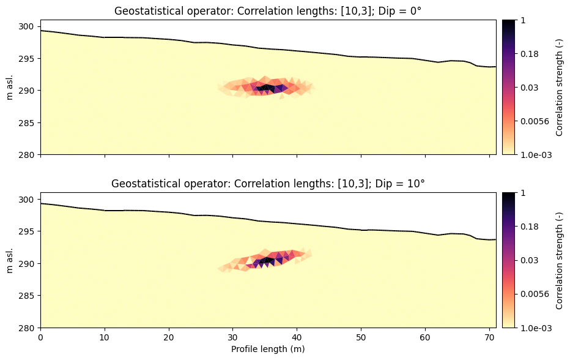

# Constrained and "structurally-informed" inversions 
 There's more than just one data set!

##  Goals of this part of the workshop 

::: {.incremental}
-   Get to know the possibilities of **including a-priori information** as constraints into inversions.

-   Incorporate **geological and structural** a-priori information into regularization. 

-   Incorporate  reflectors visible in **GPR measurements** as constraints in ERT.

-   Apply **interactive tools** to extract constraints from images or models.
:::

## Including structural information 

::: {.incremental}

-   Structural information can be a **useful addition** to any inversion to **reduce ambiguity**.

-   Goal: give **"hints"** to the inversion as to **where we expect parameter jumps / contrasts**.

-   Possible sources of information:

    - **wave methods (seismics, GPR,...)**
    - point-wise **lithological borehole information**
    - **geological maps** or models / cross sections
    - ...

-   Those information can be **easily integrated** into the mesh used for inversion 
:::

## Geostatistical regularization 

-   **Alternative way to smoothness-constrained inversions** using a covariance matrix to quantify the correlation of model parameters in different cells

-   Based on **geological or structural analysis**, an estimation of *i) vertical and horizontal correlation lengths*, *ii) the dip angle* and *iii) the strike direction* (in 3D) is included into the inversion

-   The resulting **covariance matrix** is given as:

$$
    \mathbf{C}_{\text{M,i,j}} = \sigma^2 exp\left(-3 \sqrt{\left(\frac{\mathbf{H_{x,i,j}}}{I_x}\right)^2 + \left(\frac{\mathbf{H_{y,i,j}}}{I_y}\right)^2 + \left(\frac{\mathbf{H_{z,i,j}}}{I_z}\right)^2}\right)
$${#eq-covar}

-   Each **row** of the covariance matrix contains the **spatial correlation function for one particular cell**.

-   Example notebook: `Applying geostatistical constraints`

## Geostatistical regularization 

-   **Alternative way to smoothness-constrained inversions** using a covariance matrix to quantify the correlation of model parameters in different cells

-   Based on **geological or structural analysis**, an estimation of *i) vertical and horizontal correlation lengths*, *ii) the dip angle* and *iii) the strike direction* (in 3D) is included into the inversion

-   The resulting **covariance for a single model cell** looks as follows:

{fig-align="center"}

## Inversion with simple structural constraints

-   Structural information can not only be derived from geological or structural information, but also from **measurements using other geophysical methods**.

-   In our case: measured **GPR data** are loaded and **reflector is picked** to define a structural constraint to further refine an ERT inversion.

- Other possibilities: **1D downhole geophysical measurements**, other wave methods (reflection seismics), ...

{fig-align="center"}

##  Takeaway messages:
:::{.incremental}

- We **applied advanced regularization techniques** to our individual inversions

- We **constrained the individual inversions** using 
  * **geological borehole information**
  * **GPR reflections**

- We **evaluated and compared** the constrained models and quantified the effect of adding a-priori information
::: 